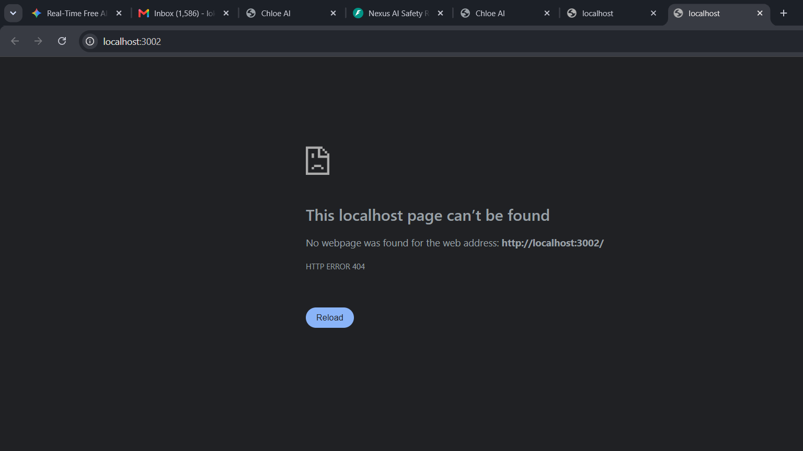

# Chloe AI - 3D Virtual Companion

A local, real-time 3D VRM AI Avatar that runs entirely offline. Chat with Chloe using voice or text, watch her dance, change backgrounds, and interact with a living 3D character.



## Features

- **3D VRM Avatar** — Real-time rendered with Three.js, loads any `.vrm` file
- **Voice Chat** — Web Speech API for STT, Kokoro-82M or browser TTS fallback
- **Lip Sync** — Real-time mouth movement synced to audio output
- **Idle Animations** — Natural breathing, blinking, weight shifting, random head movements
- **Dance Mode** — Say "dance" or click the Dance button
- **Motion Tags** — Avatar reacts with gestures (wave, nod, laugh, think, shrug, surprise)
- **Zoom Controls** — Scroll wheel or +/- buttons, pinch on mobile
- **Background Colors** — Color picker to change the scene background
- **Drag & Drop** — Hot-swap any `.vrm` file onto the viewport
- **100% Local** — No paid APIs, runs on Ollama (gemma4) + optional Kokoro TTS

## Quick Start

### Prerequisites
- [Node.js](https://nodejs.org/) v18+
- [Ollama](https://ollama.ai/) with `gemma4:latest` model
- Chrome/Edge browser (for Web Speech API)

### Run
```bash
# 1. Start Ollama (in a separate terminal)
ollama serve

# 2. Install and run the app
cd "Ai Chat girl"
npm install
npm run dev
```

Open `http://localhost:3000` in Chrome.

### Optional: Kokoro TTS
For higher quality voice, run the Kokoro-82M ONNX server on port 8880:
```bash
docker run -p 8880:8000 rhymes-ai/kokoro:82m
```
If not running, the app falls back to browser SpeechSynthesis automatically.

## Project Structure

```
├── index.html          # Main UI
├── src/
│   ├── main.js         # App orchestrator
│   ├── vrmManager.js   # 3D engine, animations, lip sync
│   ├── ollamaService.js # LLM communication + motion tags
│   └── audioService.js  # STT + TTS + audio analysis
├── public/
│   └── GIRL1.vrm       # Default avatar model
├── config/
│   └── Modelfile        # Ollama model config
└── vite.config.js       # Build config
```

## Controls

| Control | Action |
|---------|--------|
| Click Mic | Toggle voice input |
| Type + Send | Text chat |
| Scroll wheel | Zoom in/out |
| +/- buttons | Zoom in/out |
| Color picker | Change background |
| Dance button | Make Chloe dance |
| Drag .vrm file | Swap avatar |
| Move mouse | Chloe looks at cursor |

## Tech Stack

- Three.js + @pixiv/three-vrm
- Ollama (gemma4:latest)
- Vite
- Tailwind-inspired UI
- Web Speech API
- Web Audio API (AnalyserNode for lip sync)

## License

MIT